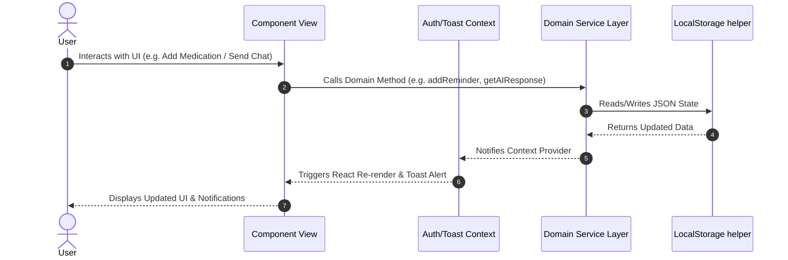
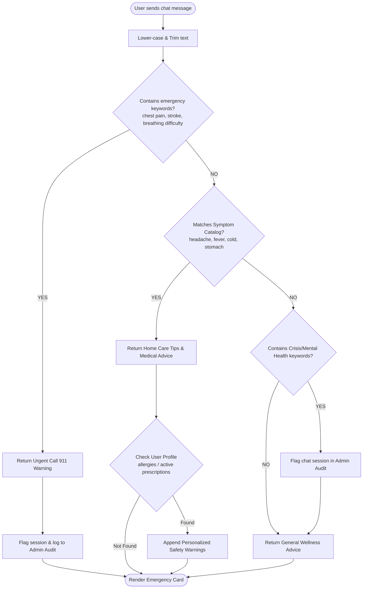

# 🏥 AI Medical Assistance Bot — Architecture Blueprint

Welcome to the simple and understandable architecture documentation for **AI Medical Assistance Bot** (MedBot). This document breaks down the system design, layer responsibilities, data flow, and visual diagrams for developers and stakeholders.

---

## 🎯 Architecture Overview

MedBot is built following a **4-Tier Modular Clean Architecture** using **React 19**, **Vite**, and **React Context API**. 

The architecture strictly separates UI representation from business logic, data persistence, and state management.


```mermaid
graph TD
    subgraph Tier 1: Presentation Layer UI
        A[App Container] --> B[Login View]
        A --> C[Dashboard View]
        A --> D[AI Health Chat View]
        A --> E[Symptom Checker View]
        A --> F[Reminders & Schedule View]
        A --> G[Health Library CMS View]
        A --> H[My Profile View]
        A --> I[Emergency Protocol View]
        A --> J[Admin Portal View]
    end

    subgraph Tier 2: State Management Layer
        ContextA[Auth Context]
        ContextB[Toast Context]
    end

    subgraph Tier 3: Domain Service Layer
        S1[authService.js]
        S2[aiService.js]
        S3[reminderService.js]
        S4[articleService.js]
        S5[adminService.js]
        S6[storage.js]
    end

    subgraph Tier 4: Data & Storage Layer
        DB[(Browser LocalStorage)]
    end

    %% Component Connections
    Tier 1 <--> Tier 2
    Tier 2 <--> Tier 3
    Tier 3 <--> Tier 4
```

---

## 🔄 Data Flow & State Lifecycle



---

## 🤖 AI Response & Emergency Safety Logic Flow

Safety and rapid medical escalation are built into the core AI service layer:



---

## 📂 Directory Structure Map

```
c:/Sakshi coding/AI Medical Assistance Bot/
├── ARCHITECTURE.md            # System architecture blueprint & diagrams
├── README.md                  # Project introduction & setup instructions
├── package.json               # Project dependencies (React 19, Vite, Lucide-React)
├── vite.config.js             # Vite bundler configuration
└── src/
    ├── main.jsx               # Application root launcher
    ├── App.jsx                # Layout Shell, Navigation & Screen Routing
    ├── index.css              # Glassmorphism & Healthcare Design System CSS
    │
    ├── constants/             # Centralized Constants
    │   └── navItems.js        # Navigation items catalog
    │
    ├── context/               # React Context Providers (State Layer)
    │   ├── AuthContext.jsx    # Global user session & state
    │   └── ToastContext.jsx   # Global notification alert toasts
    │
    ├── services/              # Business Logic & Services (Service Layer)
    │   ├── storage.js         # LocalStorage wrapper & seed initializer
    │   ├── authService.js     # Login, registration & user session logic
    │   ├── aiService.js       # AI chat bot heuristics & emergency keyword scanner
    │   ├── reminderService.js # Medicine reminders & appointments CRUD
    │   ├── articleService.js  # Health library articles CMS
    │   └── adminService.js    # System analytics & safety audit logs
    │
    ├── utils/                 # Utility Compatibility Layer
    │   └── mockData.js        # Re-export bridge for backward compatibility
    │
    └── components/            # UI Components (Presentation Layer)
        ├── Login.jsx          # User Sign-in & Registration modal
        ├── Dashboard.jsx      # Home overview, metric cards & quick actions
        ├── ChatBot.jsx        # AI Conversational interface
        ├── SymptomChecker.jsx # Interactive step-by-step diagnostic tool
        ├── Reminders.jsx      # Medicine schedule & doctor appointments management
        ├── HealthTips.jsx     # Categorized articles library & reader
        ├── Profile.jsx        # Patient health profile (allergies, meds, age)
        ├── Emergency.jsx      # Hotline buttons & hospital locator
        └── AdminPanel.jsx     # System metrics & security audit dashboard
```

---

## 🏛️ Core Design Principles

1. **Separation of Concerns (SoC):** 
   Components focus purely on rendering UI elements and receiving user actions. Business logic is isolated inside dedicated services (`services/*Service.js`).
2. **Single Source of Truth:** 
   Global states like logged-in user details, active notifications, and reminders reside in Context Providers (`AuthContext`, `ToastContext`), preventing prop drilling.
3. **Safety First Escalation:**
   Emergency condition checks happen synchronously in `aiService.js` prior to evaluating any general chat logic.
4. **Clean Abstraction & Modularity:**
   Each service handles a single domain: Auth, AI, Reminders, Articles, or Analytics.

---

## 🚀 Scaling to Production (Backend Integration)

When ready to transition from a client-side prototype to a full cloud backend:

1. **Replace `storage.js` with REST API Client:**
   Swap local storage calls with `axios` or `fetch` calls pointing to a Node.js / Express backend.
2. **Integrate Real LLM Endpoints:**
   In `aiService.js`, replace heuristic matching with requests to Google Gemini AI API (`@google/genai`).
3. **JWT Authentication:**
   Update `authService.js` to store secure JWT tokens in `HttpOnly` cookies.
